<div align="center">
    
</div>
<h1 align="center">BetterTG</h1>
<p align="center">A Telegram client for iOS</p>


[](https://opensource.org/licenses/)

# Currently implemented

- login
- all chats with people from main folder/archive
- sending/reading text/photo/voice/album messages
- replying to/editing messages
- draft, forwarded from
- animojis (tgs, webp, sometimes webm)
- pinned chats
- searching your/global chats
- custom settings sheet
- unique UI
- last seen online
- formatting/formatted messages
- live activity with opened chat

# Road Map

[GitHub Project](https://github.com/users/levochkaa/projects/1/views/1)

# Installation

Download an .ipa file from [releases tab](https://github.com/levochkaa/BetterTG/releases/latest) and install through [Sideloadly](https://altstore.io)
or [AltStore (suggested)](https://altstore.io).

**Soon, I will buy Paid Apple Developer account, I promise.**

# Screenshots

<span></span>
<span>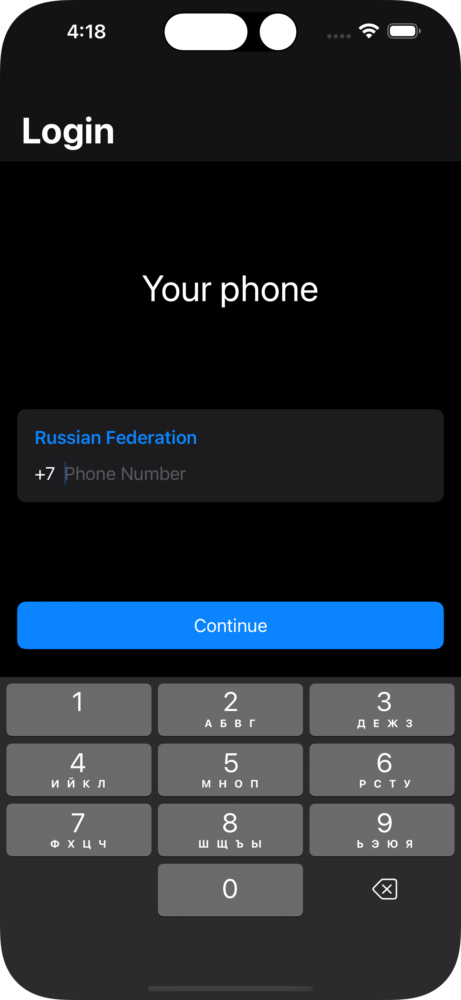</span>
<span>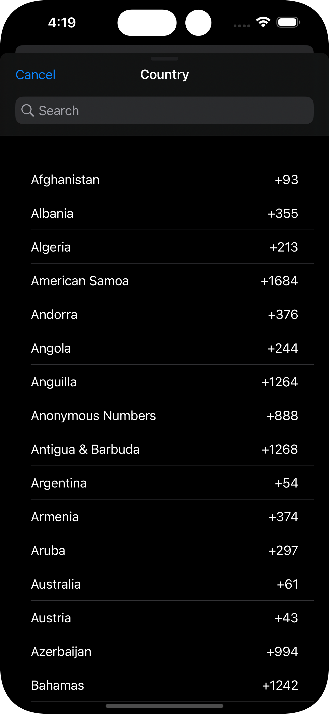</span>
<span>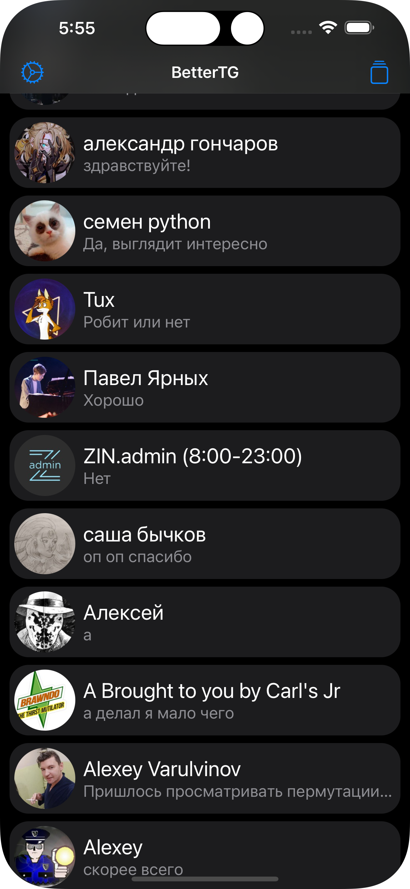</span>
<span>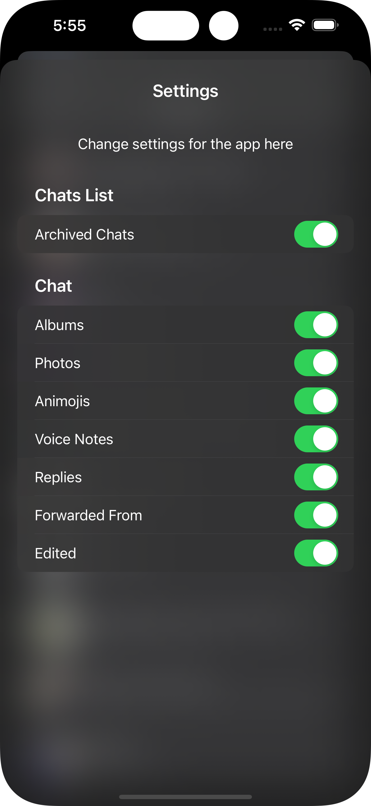</span>
<span>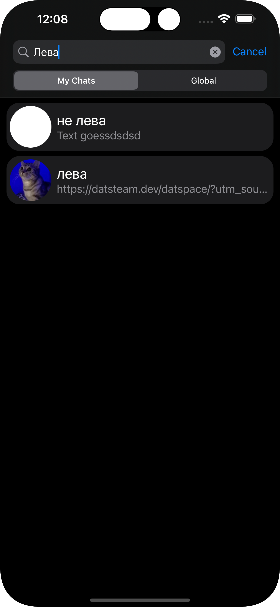</span>
<span>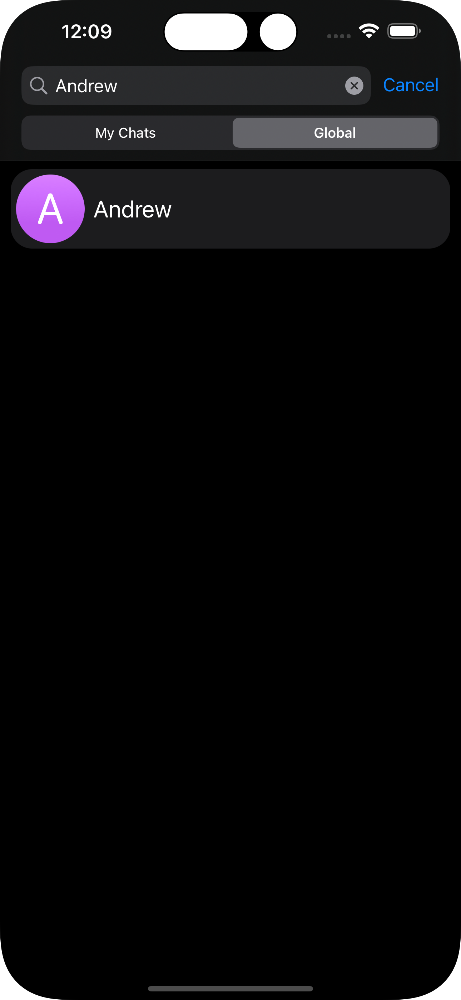</span>
<span>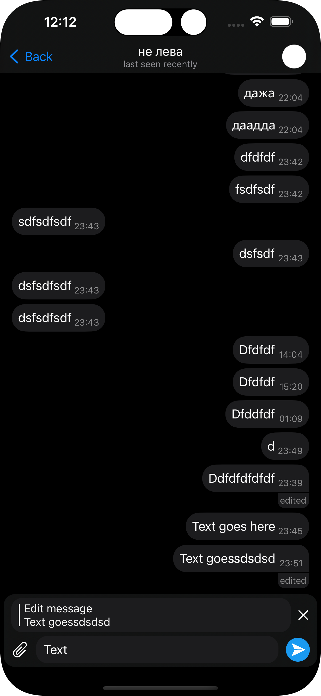</span>
<span>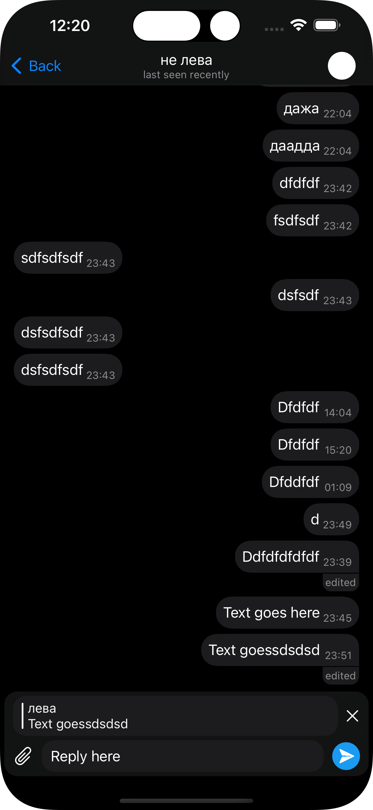</span>
<span>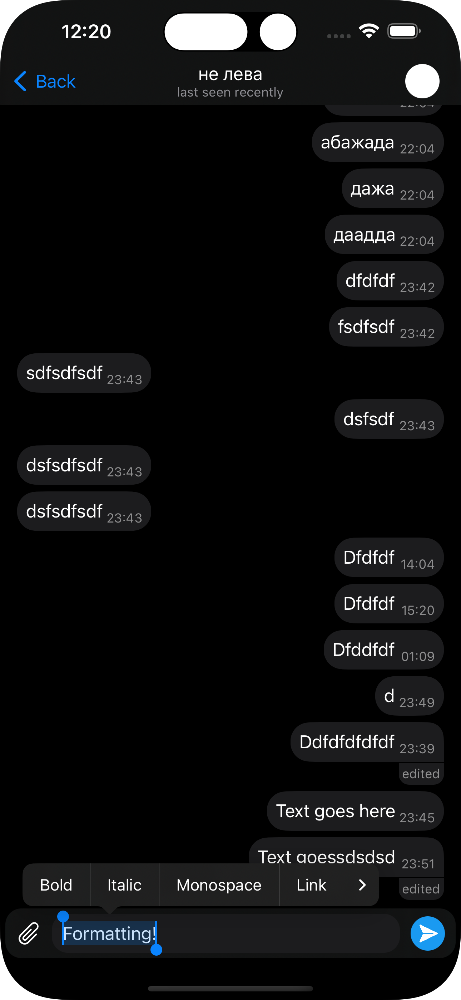</span>
<span>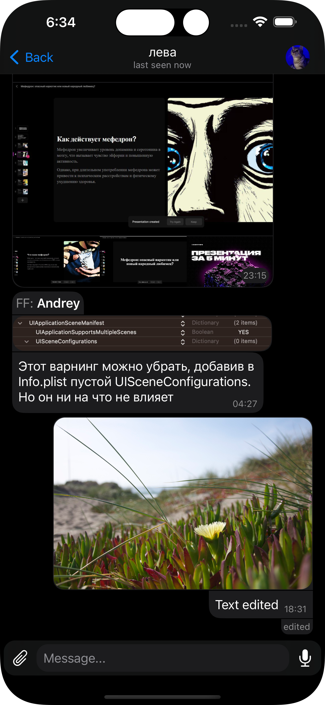</span>
<span>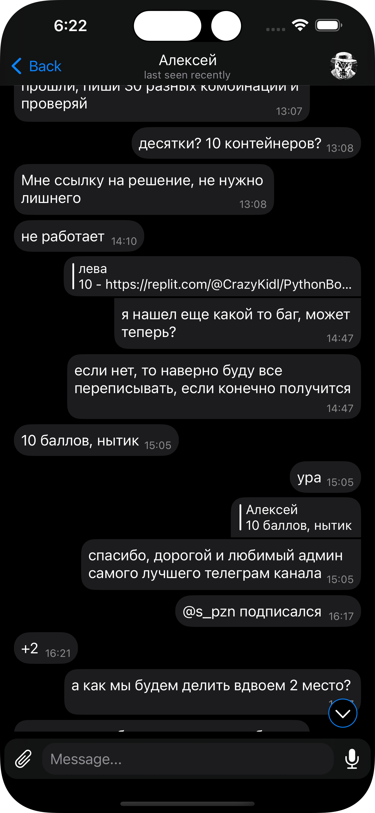</span>
<span>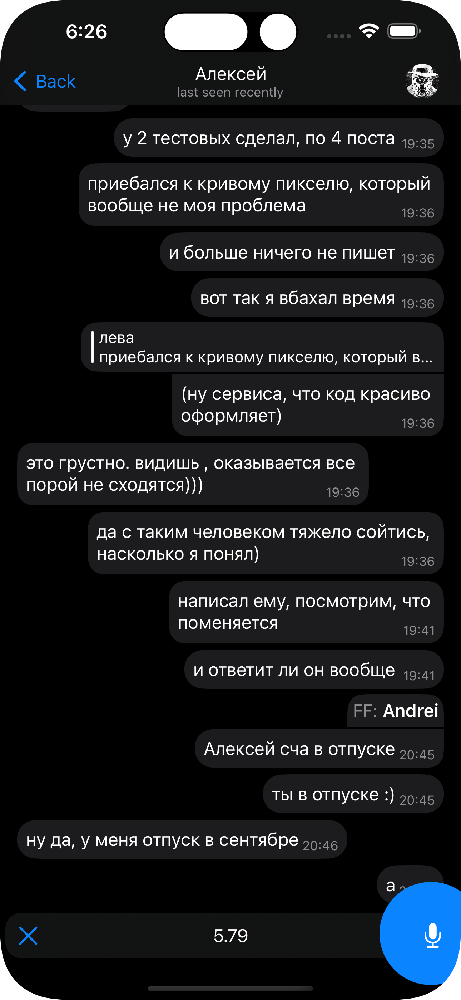</span>
<span>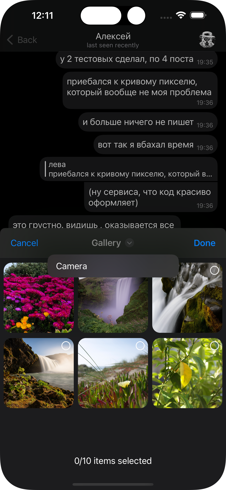</span>
<span>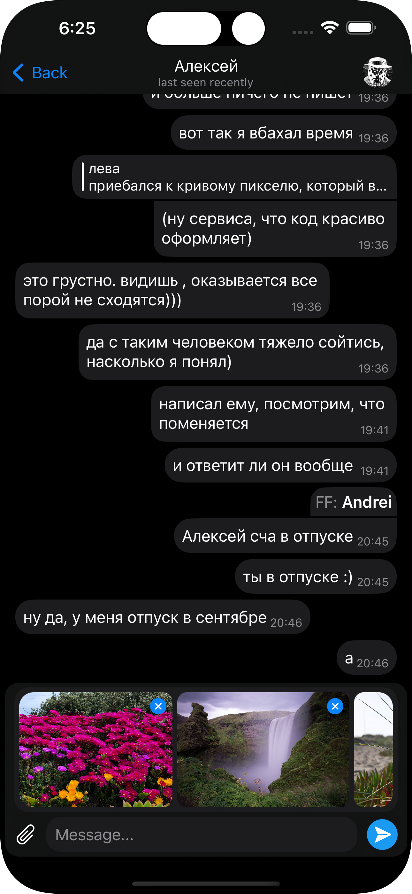</span>
<span></span>
<span>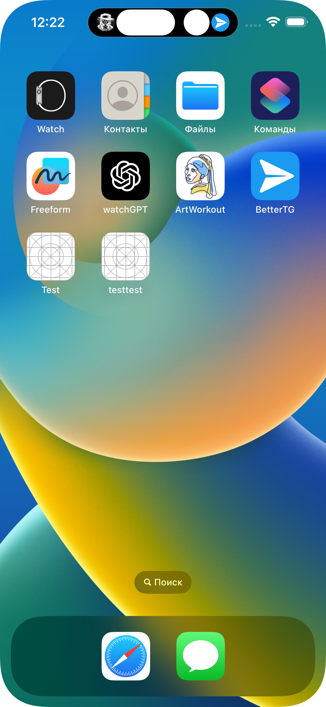</span>
<span></span>

# Contributing

You can contribute **any** change you want to!

**But, if you are intreseted in the project Road Map, check this [GitHub Project](https://github.com/users/levochkaa/projects/1/views/1)**

## Step 1 - Clone the repo

```shell
git clone https://github.com/levochkaa/BetterTG.git
```

## Step 2 - Download XCode

Latest **Xcode 14 beta** versions are used for this project.\
I suggest using [**Xcodes**](https://github.com/RobotsAndPencils/XcodesApp) for downloading XCode.

## Step 3 - `api_id` and `api_hash`

Go to [this site](https://my.telegram.org/).\
Log in, open **API development tools**, fill up the info.\
Then click **Save changes**
at the bottom of the page. \
Leave the page **open** for the next step.

## Step 4 - Development environment

You need to have [Homebrew](https://brew.sh) installed. \
Now run these commands:

```shell
brew install swift-sh
sudo chmod +x environment.swift
sudo chmod +x gyb.sh
./environment.swift <api_id> <api_hash>
```

Everything is set up now! **GL HF**
